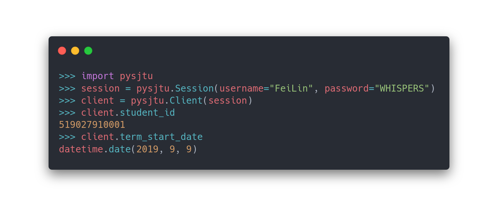

<p align="center"><strong>PySJTU</strong> <em>- The Python iSJTU client for Humans.</em></p>

<p align="center">
<a href="https://github.com/PhotonQuantum/pysjtu">
    
<a href="https://badge.fury.io/py/pysjtu">
    
</a>
<a href='https://pysjtu.readthedocs.io/en/latest/?badge=latest'>
    
</a>
<a href="https://www.codacy.com/manual/PhotonQuantum/pysjtu?utm_source=github.com&amp;utm_medium=referral&amp;utm_content=PhotonQuantum/pysjtu&amp;utm_campaign=Badge_Coverage">
    
</a>
<a href="https://www.codacy.com/manual/PhotonQuantum/pysjtu?utm_source=github.com&amp;utm_medium=referral&amp;utm_content=PhotonQuantum/pysjtu&amp;utm_campaign=Badge_Grade">
    
</a>
</p>



---

```python
>>> import pysjtu
>>> c = pysjtu.create_client(username="FeiLin", password="WHISPERS")
>>> chemistry = c.schedule(year=2019, term=0).filter("大学化学")
>>> chemistry[0].teacher_name
['麦亦勇']
>>> calculus_exam = c.exam(year=2019, term=0).filter(course_id="MA248")
>>> calculus_exam[0].date
datetime.date(2019, 11, 6)
```

And, to persist your session...

```python
>>> import pysjtu
>>> session = pysjtu.Session()
>>> session.login("FeiLin", "WHISPERS")
>>> session.dump("lin_fei.session")

>>> session = pysjtu.Session()
>>> session.load("lin_fei.session")
>>> pysjtu.Client(session).student_id
519027910001
```

## Features

PySJTU allows you to manipulate [iSJTU](https://i.sjtu.edu.cn) APIs easily.

You don't need to construct queries on your own, or guessing the meaning of poorly named variables (to name a few, `kch_id`, `rwzxs`) any more. 
Now `course.name` `course.hour_total` is enough!

Main features of PySJTU:

- A friendly API with understandable attribute names.
- Easy session persistence.
- Robust captcha recognition using ResNet.
- 80% iSJTU APIs covered. (Course selection APIs included.)
- Fully type annotated.
- 99% test coverage.

## Installation

Install with pip:

```shell script
$ pip install pysjtu[ocr]
```

> You may omit 'ocr' extra dependencies if you don't need the builtin captcha recognizers.
> 
> Python 3.9 still doesn't have a prebuilt ONNXRuntime release, so 'ocr' features won't work on it.
>
> (You may still use the JCSSRecognizer which depends on a remote service called [JCSS](https://github.com/PhotonQuantum/jcss).)

PySJTU requires Python 3.7+.

## Built With

- [HTTPX](https://www.python-httpx.org/) - A next generation HTTP client for Python.
- [marshmallow](https://github.com/marshmallow-code/marshmallow) - An ORM/ODM/framework-agnostic library for converting complex datatypes, such as objects, to and from native Python datatypes.
- [ONNX Runtime](https://github.com/microsoft/onnxruntime) - A performance-focused complete scoring engine for Open Neural Network Exchange (ONNX) models.
- [NumPy](https://numpy.org/) - The fundamental package for scientific computing with Python.
- [Pillow](https://python-pillow.org/) - The friendly PIL fork.

## License

This project is licensed under GNU General Public License v3.0 - see the [LICENSE](LICENSE) file for details.

<p align="center">&mdash;💖&mdash;</p>
<p align="center"><i>Built with love by LightQuantum</i></p>
